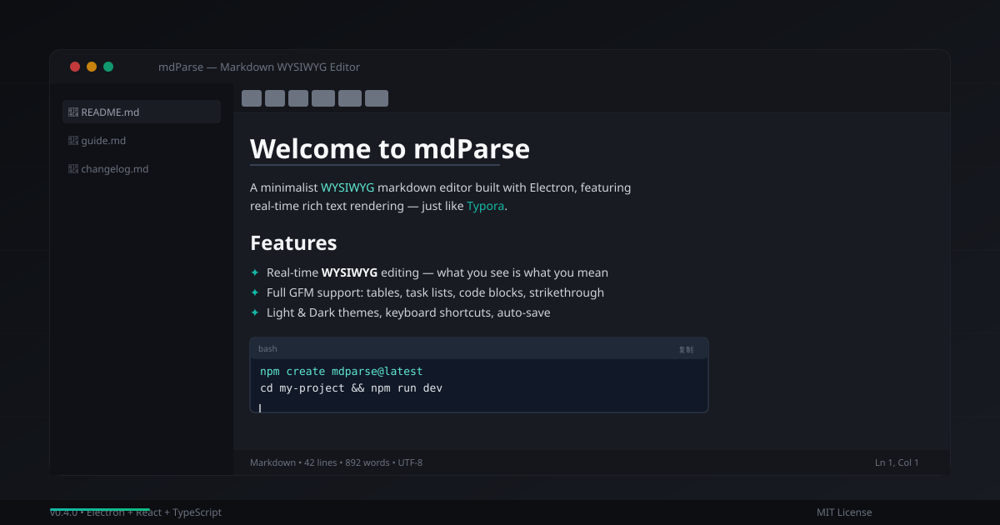

# mdParse

> 一个类 Typora 的 Markdown WYSIWYG 编辑器 —— 所见即所得，实时渲染。

<p align="center">
  
</p>

<p align="center">
  
  
  
  
</p>

---

## 特性

- **WYSIWYG 编辑** — 在渲染后的富文本上直接编辑，像写 Word 一样写 Markdown
- **全 GFM 支持** — 表格、任务列表、代码块、删除线、自动链接
- **工具栏 + 快捷键** — 加粗 `Ctrl+B` / 斜体 `Ctrl+I` / 标题 `Ctrl+1~3`
- **多文件管理** — 侧边栏文件树，快速切换
- **自动保存** — 编辑即保存，无需手动
- **双主题** — 亮色/暗色，一键切换

## 快速开始

```bash
# 安装依赖
npm install

# Web 开发模式
npm run dev

# 桌面应用开发
npm run electron:dev

# 构建
npm run build
```

## 技术栈

| 类别 | 技术 |
|------|------|
| 框架 | React 19 + TypeScript |
| 构建 | Vite 8 |
| 桌面 | Electron 22 |
| 富文本 | `contentEditable` + `marked` + `turndown` |
| 样式 | TailwindCSS 4 |
| Markdown | `react-markdown` + `remark-gfm` |

## 快捷键

| 操作 | 快捷键 |
|------|--------|
| 加粗 | `Ctrl/Cmd + B` |
| 斜体 | `Ctrl/Cmd + I` |
| 链接 | `Ctrl/Cmd + K` |
| 标题 1/2/3 | `Ctrl/Cmd + 1/2/3` |
| 保存 | `Ctrl/Cmd + S` |
| 新建 | `Ctrl/Cmd + N` |
| 打开 | `Ctrl/Cmd + O` |
| 搜索 | `Ctrl/Cmd + F` |
| 关闭文件 | `Ctrl/Cmd + W` |
| 切换主题 | `Ctrl/Cmd + Shift + T` |

## 项目结构

```
src/
├── App.tsx                  # 主应用
├── components/
│   ├── WYSIWYGEditor.tsx    # WYSIWYG 编辑器（contentEditable）
│   ├── MarkdownEditor.tsx   # 编辑器容器（标题栏 + 工具栏）
│   ├── MarkdownToolbar.tsx  # 格式化工具栏
│   ├── FileSidebar.tsx      # 文件侧边栏
│   └── ...
├── contexts/
│   ├── FileContext.tsx       # 文件状态管理
│   ├── ThemeContext.tsx      # 主题状态
│   └── UISettingsContext.tsx # UI 设置
├── hooks/                   # 自定义 Hooks
├── types/                   # TypeScript 类型
└── constants/               # 常量
```

## 版本历史

### v0.4.0 (2026-06-28) — WYSIWYG 版本

- **重写编辑器**：移除 CodeMirror 6，改用 `contentEditable` + `marked` + `turndown` 实现 Typora 风格 WYSIWYG
- **实时渲染**：Markdown 实时渲染为富文本，编辑即所见
- **工具栏重构**：所有格式化操作通过 `execCommand` 直接操作富文本
- **主题修复**：暗色模式文本颜色全面修复
- **删除冗余**：移除 AI 功能、未使用的组件和 4 份过时文档

### v0.3.0 (2026-05-20) — 深度优化版本

- 架构重构、性能优化、安全性提升

## 许可证

MIT License — 详见 [LICENSE](LICENSE)
